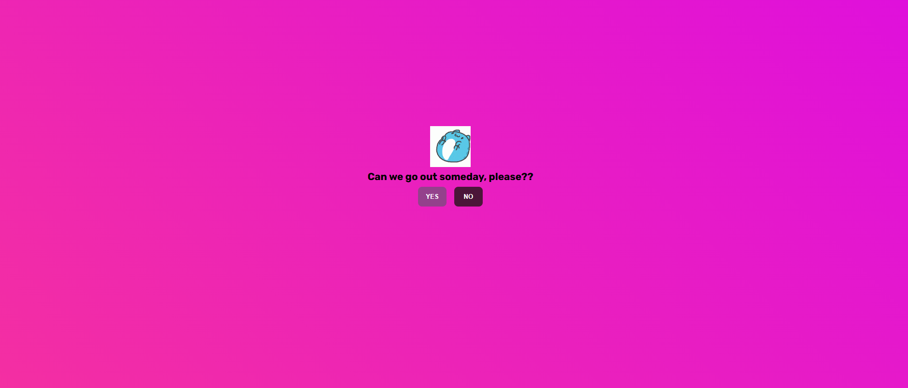
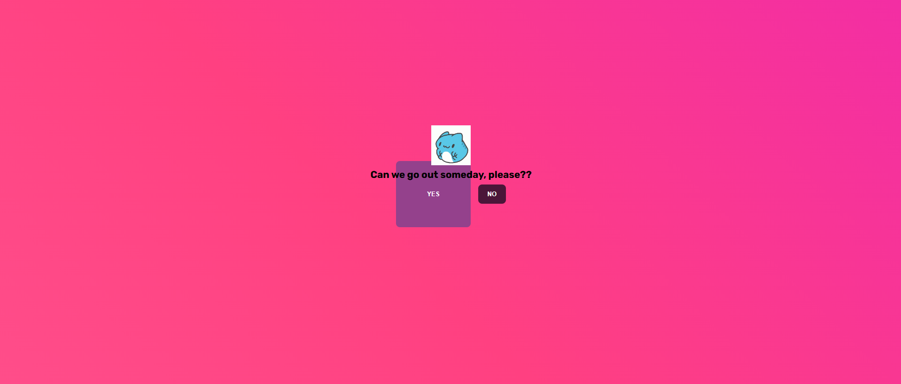
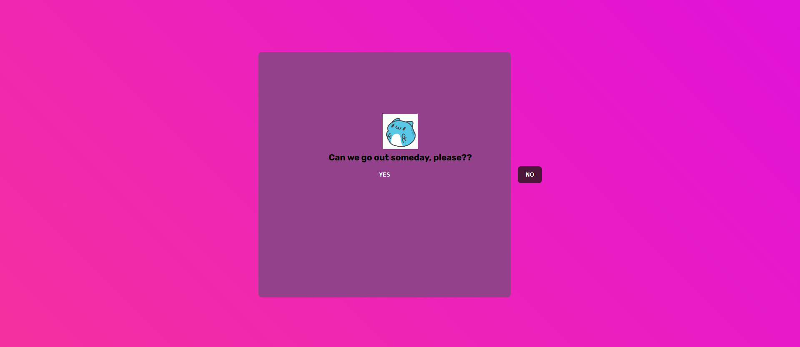
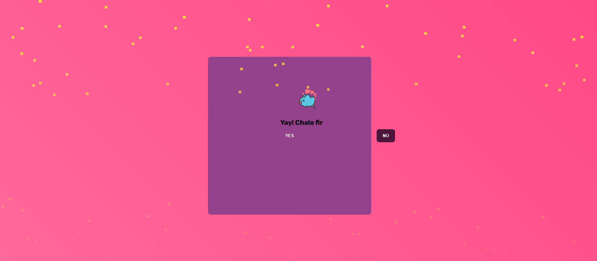

# Let's Go Out

A fun and interactive webpage that playfully asks users if they want to go out, complete with colorful animations, responsive buttons, and a celebratory confetti effect for added enjoyment!

## Project Structure

This project is divided into three main files:

- **index.html** - The main HTML file that structures the content and layout of the webpage.
- **style.css** - The CSS file that provides styling, animations, and background effects.
- **script.js** - The JavaScript file that handles button interactions and generates confetti when the "YES" button is clicked.

## Features

- **Gradient Background Animation**: A vibrant color transition across a gradient background, creating an inviting atmosphere.
- **Interactive Buttons**: Two playful buttons, "YES" and "NO," with unique interactions:
    - Clicking **"YES"** triggers a confetti effect and displays a joyful message.
    - Clicking **"NO"** enlarges the "YES" button, inviting the user to reconsider.
- **Confetti Animation**: A fun confetti effect fills the screen when the user clicks "YES," adding a celebratory touch.

## Screenshots

1. **Normal Screen** - Initial view with "YES" and "NO" buttons:
   

2. **Increasing YES Size (Step 1)** - The "YES" button grows larger after clicking "NO":
   

3. **Increasing YES Size (Step 2)** - The "YES" button grows even larger after clicking "NO" again:
   

4. **YES with Confetti Animation** - After clicking "YES," confetti falls and a celebration message appears:
   

## Usage

1. **Open `index.html`** in a web browser to view the webpage.
2. Click on **"YES"** or **"NO"** to interact with the buttons and experience the effects.

## Setup and Installation

1. Clone or download this repository to your local machine.
2. Ensure that the files `index.html`, `style.css`, and `script.js` are in the same directory.
3. Open `index.html` in any web browser to interact with the page.

## Files

- **index.html**: Contains the structure and elements for the webpage, including buttons, text, and image elements.
- **style.css**: Includes styles for animations, button appearances, and layout formatting.
- **script.js**: Defines the JavaScript functions for button interactions and confetti generation.

## Preview

- **Background**: A colorful, animated gradient background that shifts colors smoothly.
- **Buttons**: Stylish, responsive buttons with unique "YES" and "NO" interactions.
- **Confetti**: A fun, animated confetti effect that activates when clicking "YES".

---

Enjoy this playful project designed for a bit of light-hearted fun with web animations and interactivity!
